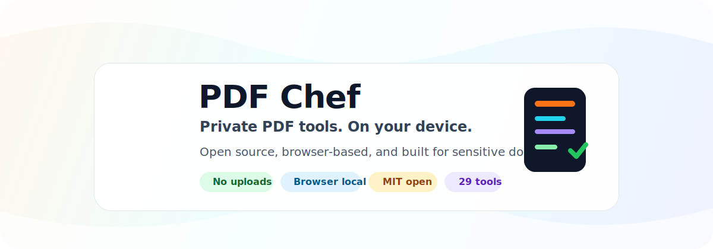

<p align="center">
  
</p>

<p align="center">
  <a href="https://pdfchef.dhananjaytech.app/">
    
  </a>
</p>

<h1 align="center">PDF Chef</h1>

<p align="center">
  <strong>Open-source PDF tools for private documents.</strong>
  <br>
  Merge, split, convert, sign, clean, OCR, compare, and secure PDFs in your browser with no server upload for PDF processing.
</p>

<p align="center">
  <a href="https://pdfchef.dhananjaytech.app/"><strong>Use the app</strong></a>
  ·
  <a href="#privacy-first-by-design">Privacy model</a>
  ·
  <a href="#toolkit">Toolkit</a>
  ·
  <a href="#run-locally">Run locally</a>
  ·
  <a href="#download-a-release">Download</a>
  ·
  <a href="#contributing">Contribute</a>
</p>

<p align="center">
  <a href="https://pdfchef.dhananjaytech.app/">
    
  </a>
  <a href="./LICENSE">
    
  </a>
  
  
  
  
  
  
  
</p>

---

## Why PDF Chef

Online PDF tools often ask users to upload sensitive documents before doing anything useful. PDF Chef is built around the opposite promise: serve the app, then process the document locally in the browser.

That matters for contracts, invoices, tax forms, school records, IDs, resumes, internal reports, legal drafts, and every other file users should not casually upload to a random conversion server.

<table>
  <tr>
    <td><strong>Private by default</strong><br>No PDF file upload for normal tool workflows.</td>
    <td><strong>Open source</strong><br>MIT licensed and inspectable on GitHub.</td>
    <td><strong>Browser local</strong><br>PDF.js, pdf-lib, jsPDF, JSZip, and Tesseract.js run client-side.</td>
  </tr>
  <tr>
    <td><strong>No account wall</strong><br>Use the public app without signing in.</td>
    <td><strong>Practical toolkit</strong><br>29 tools covering daily PDF work.</td>
    <td><strong>Static deploy</strong><br>Hosted on Cloudflare Pages, portable to static hosts.</td>
  </tr>
</table>

## Privacy-first by design

PDF Chef is not a cloud conversion pipeline. It is a static web app with client-side PDF operations.

| User concern | PDF Chef answer |
| --- | --- |
| Will my PDF be uploaded? | No PDF file is uploaded to a PDF Chef server for the core tools. |
| Where does processing happen? | In the browser on the user's device. |
| Do I need an account? | No account is required. |
| Can I inspect the code? | Yes. The project is open source under MIT. |
| What network requests exist? | The browser downloads app assets, scripts, styles, and workers from the deployed site. User PDFs are handled locally by the app. |
| Can this be self-hosted? | Yes. Build the Vite app and serve the static output. |

### Privacy guarantees

- User-selected PDFs stay on the device during normal PDF tool workflows.
- PDF operations are implemented with browser-side libraries instead of a document-processing backend.
- No required login, workspace, or cloud storage account.
- No third-party document conversion API.
- Security-sensitive reports are handled privately through [SECURITY.md](./SECURITY.md).
- New contributions are expected to preserve the no-upload model.

## Toolkit

PDF Chef focuses on tools people actually need during day-to-day document work.

| Arrange | Convert and create | Review and secure |
| --- | --- | --- |
| Merge PDFs | Compress PDFs | View PDFs |
| Split PDFs | PDF to JPG, PNG, WebP | Edit PDF overlays |
| Reorder pages | Image to PDF | Compare PDFs |
| Rotate pages | Make PDF from photos | Extract text and OCR |
| Delete pages | Extract embedded images | View and edit metadata |
| Extract selected pages |  | Remove metadata |
| Add page numbers |  | Remove annotations |
| Add watermarks |  | Sanitize PDFs |
| Flatten form fields |  | Sign PDFs |
| Crop margins |  | Protect PDFs |
| Add headers and footers |  | Unlock PDFs |
| Remove blank pages |  | Repair PDFs |

## Product quality

- **Preview-first workflows**: compression, signing, watermarking, page numbers, OCR, compare, and conversion flows show visual feedback before export.
- **Cleanup tools**: remove metadata, annotations, blank pages, and hidden document data.
- **Mobile-aware UI**: touch-friendly page operations and responsive layouts.
- **SEO coverage**: each public tool has route-level metadata and sitemap coverage.
- **Catalog verification**: `npm run test:catalog` prevents dashboard, route, SEO, and sitemap drift.

## Architecture

```text
Browser
  -> React + TypeScript UI
  -> PDF.js for parsing and rendering
  -> pdf-lib and jsPDF for document edits and exports
  -> Tesseract.js for OCR
  -> JSZip for packaged downloads
  -> Local download back to the user

Cloudflare Pages
  -> Serves static HTML, CSS, JS, images, and workers
  -> Does not receive user PDFs for core processing
```

## Tech stack

| Layer | Tools |
| --- | --- |
| App | React 18, TypeScript, Vite |
| Styling | Tailwind CSS, lucide-react |
| PDF runtime | PDF.js, pdf-lib, jsPDF |
| OCR and assets | Tesseract.js, JSZip |
| Hosting | Cloudflare Pages |
| Verification | TypeScript, catalog verifier, production build |

## Run locally

Prerequisite: Node.js 18 or newer.

```bash
npm install
npm run dev
```

Open the local URL printed by Vite.

## Quality checks

```bash
npm run lint
npm run test:catalog
npm run build
```

`test:catalog` verifies that dashboard tools have matching app routes, SEO metadata, and sitemap entries.

## Deploy

The production app is deployed on Cloudflare Pages:

[https://pdfchef.dhananjaytech.app/](https://pdfchef.dhananjaytech.app/)

Build output lives in `dist`:

```bash
npm run build
```

## Download a release

PDF Chef releases include a ready-to-serve static ZIP. This is useful when you want to run the app locally or host it yourself without setting up the development toolchain.

1. Open the [latest release](https://github.com/DhananjayBhosale/PDFChef/releases/latest).
2. Download `pdfchef-<version>.zip`.
3. Extract the ZIP.
4. Serve the extracted folder with any static HTTP server.

Quick start:

```bash
# Using Python
cd pdfchef
python -m http.server 8080

# Or using Node.js
npx serve .
```

Then open [http://localhost:8080](http://localhost:8080).

Do not open `index.html` directly from the filesystem. Browser security rules can block module scripts and PDF workers when loaded from `file://`.

## Project structure

```text
components/      React UI, pages, tools, SEO helpers
services/        Browser-side PDF operations
hooks/           Shared React state and PDF handoff helpers
scripts/         Verification and benchmark utilities
public/          Static assets, robots.txt, sitemap.xml
design-system/   Durable product and UI decisions
```

## Roadmap

- More browser-safe PDF cleanup tools
- Stronger automated tests around PDF operations
- Better large-file performance and progress reporting
- Accessibility audits for every tool route
- Optional self-hosting guide

## Contributing

Contributions are welcome when they strengthen the local-first PDF model.

High-value areas:

- new tools that preserve the no-upload privacy model
- browser-side performance improvements for large PDFs
- accessibility fixes
- focused tests around PDF operations and route coverage
- documentation that makes privacy and local processing easier to verify

Read [CONTRIBUTING.md](./CONTRIBUTING.md) before opening a pull request.

## Security

Please do not open public issues for security-sensitive reports. See [SECURITY.md](./SECURITY.md).

## License

PDF Chef is open source under the [MIT License](./LICENSE).
