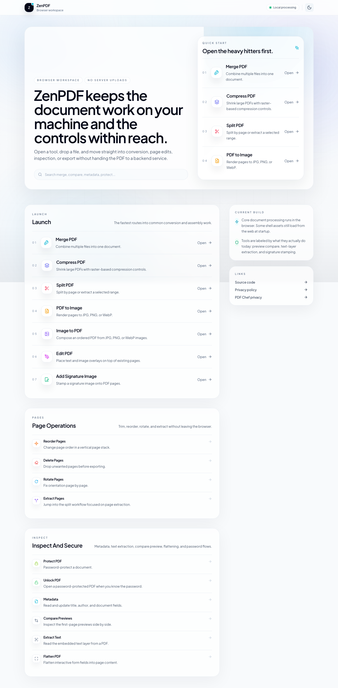

# PDF Chef

<p align="center">
  <a href="https://pdfchef.dhananjaytech.app/">
    
  </a>
  <a href="./LICENSE">
    
  </a>
  
  
</p>

<p align="center">
  <strong>Open-source PDF tools that run in your browser.</strong><br>
  Merge, split, convert, sign, clean, OCR, compare, and secure PDFs without uploading your files to a server.
</p>

<p align="center">
  <a href="https://pdfchef.dhananjaytech.app/">Try PDF Chef</a>
  ·
  <a href="#tools">Tools</a>
  ·
  <a href="#privacy-model">Privacy model</a>
  ·
  <a href="#run-locally">Run locally</a>
  ·
  <a href="#contributing">Contribute</a>
</p>



## Why PDF Chef exists

Most online PDF utilities ask users to upload sensitive documents before doing anything useful. PDF Chef takes the opposite path: the app is served as a static web app, then PDF work happens locally in the browser using client-side libraries.

That means resumes, contracts, invoices, scanned IDs, school forms, and business documents stay on the user's device during normal tool workflows.

## What makes it different

- **Open source**: the code is public, inspectable, and MIT licensed.
- **No server uploads for PDF work**: files are processed in the browser, not sent to a backend conversion API.
- **Privacy-focused by design**: the product is built around local processing, short copy, and clear user control.
- **29 practical tools**: enough breadth for real daily PDF work without turning the UI into a cluttered toolbox.
- **Polished product experience**: live previews, touch-friendly page controls, dark mode, and a focused dashboard.
- **Deployable static app**: Vite build output can be hosted on Cloudflare Pages or any static host.

## Privacy model

PDF Chef is intentionally browser-first.

| Area | How it works |
| --- | --- |
| File handling | Users select files from their device. Tool logic reads them in the browser. |
| PDF processing | PDF.js, pdf-lib, jsPDF, Tesseract.js, and related client libraries do the work locally. |
| Server uploads | No PDF file is uploaded to a PDF Chef server for the core tools. |
| Accounts | No account is required to use the public app. |
| Hosting | Cloudflare Pages serves the static site assets. |
| Offline behavior | Once loaded, many workflows can continue locally because processing is client-side. |

> Important: PDF Chef still downloads normal website assets such as JavaScript, CSS, images, and library workers from the deployed app. The privacy promise is about user PDF documents not being uploaded for processing.

## Tools

### Arrange

- Merge PDFs
- Split PDFs
- Reorder pages
- Rotate pages
- Delete pages
- Extract selected pages
- Add page numbers
- Add watermarks
- Flatten form fields
- Crop PDF margins
- Add headers and footers
- Remove blank pages

### Convert and create

- Compress PDFs
- PDF to JPG, PNG, or WebP
- Image to PDF
- Make PDF from photos
- Extract embedded images

### Review and secure

- View PDFs
- Edit PDF overlays
- Compare PDFs
- Extract text and OCR scanned pages
- View and edit metadata
- Remove metadata
- Remove annotations
- Sanitize PDFs
- Sign PDFs
- Protect PDFs with a password
- Unlock PDFs
- Repair PDFs

## Product highlights

- **Compression with preview**: inspect the result before downloading.
- **Image extraction**: pull embedded raster images from PDFs instead of only rendering full pages.
- **OCR workflow**: extract existing text or run OCR on scanned pages.
- **Signature workflow**: draw or upload signatures and place them visually.
- **Cleanup tools**: remove metadata, annotations, blank pages, and hidden document data.
- **Route-level SEO**: each public tool has dedicated metadata and sitemap coverage.
- **Catalog verification**: a lightweight test prevents dashboard routes, app routes, SEO, and sitemap entries from drifting.

## Tech stack

- React 18
- TypeScript
- Vite
- Tailwind CSS
- PDF.js
- pdf-lib
- jsPDF
- JSZip
- Tesseract.js
- Cloudflare Pages

## Run locally

Prerequisite: Node.js 18 or newer.

```bash
npm install
npm run dev
```

Open the local URL printed by Vite.

## Quality checks

```bash
npm run lint
npm run test:catalog
npm run build
```

`test:catalog` verifies that dashboard tools have matching app routes, SEO metadata, and sitemap entries.

## Deploy

The production app is deployed on Cloudflare Pages:

[https://pdfchef.dhananjaytech.app/](https://pdfchef.dhananjaytech.app/)

Build output lives in `dist`:

```bash
npm run build
```

## Project structure

```text
components/      React UI, pages, tools, SEO helpers
services/        Browser-side PDF operations
hooks/           Shared React state and PDF handoff helpers
scripts/         Verification and benchmark utilities
public/          Static assets, robots.txt, sitemap.xml
design-system/   Durable product and UI decisions
```

## Contributing

Contributions are welcome. The highest-value improvements are:

- new tools that preserve the no-upload privacy model
- browser-side performance improvements for large PDFs
- accessibility fixes
- focused tests around PDF operations and route coverage
- documentation that makes privacy and local processing easier to verify

Read [CONTRIBUTING.md](./CONTRIBUTING.md) before opening a pull request.

## Security

Please do not open public issues for security-sensitive reports. See [SECURITY.md](./SECURITY.md).

## License

PDF Chef is open source under the [MIT License](./LICENSE).
