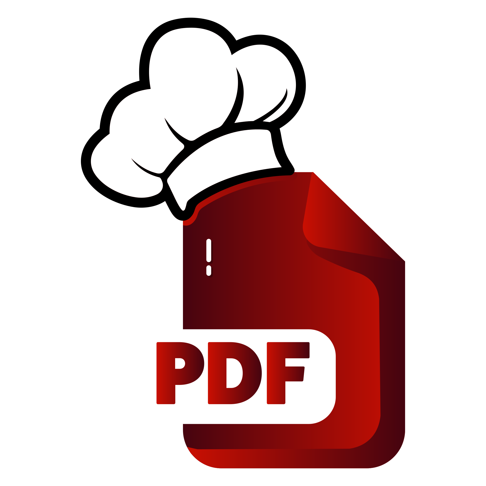
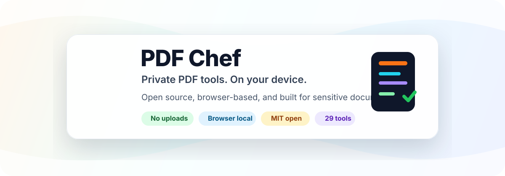

<p align="center">
  
</p>

<p align="center">
  <a href="https://pdfchef.dhananjaytech.app/">
    
  </a>
</p>

<h1 align="center">PDF Chef</h1>

<p align="center">
  <strong>Open-source PDF tools for private documents.</strong>
  <br>
  Merge, split, convert, sign, clean, OCR, compare, and secure PDFs in your browser with no server upload for PDF processing.
</p>

<p align="center">
  <a href="https://pdfchef.dhananjaytech.app/"><strong>Use the app</strong></a>
  ·
  <a href="#privacy-first-by-design">Privacy model</a>
  ·
  <a href="#toolkit">Toolkit</a>
  ·
  <a href="#run-locally">Run locally</a>
  ·
  <a href="#download-a-release">Download</a>
  ·
  <a href="#contributing">Contribute</a>
</p>

<p align="center">
  <a href="https://pdfchef.dhananjaytech.app/">
    
  </a>
  <a href="./LICENSE">
    
  </a>
  
  
  
  
  
  
  
</p>

---

## Why PDF Chef

Online PDF tools often ask users to upload sensitive documents before doing anything useful. PDF Chef is built around the opposite promise: serve the app, then process the document locally in the browser.

That matters for contracts, invoices, tax forms, school records, IDs, resumes, internal reports, legal drafts, and every other file users should not casually upload to a random conversion server.

<table>
  <tr>
    <td><strong>Private by default</strong><br>No PDF file upload for normal tool workflows.</td>
    <td><strong>Open source</strong><br>MIT licensed and inspectable on GitHub.</td>
    <td><strong>Browser local</strong><br>PDF.js, pdf-lib, jsPDF, JSZip, and Tesseract.js run client-side.</td>
  </tr>
  <tr>
    <td><strong>No account wall</strong><br>Use the public app without signing in.</td>
    <td><strong>Practical toolkit</strong><br>34 browser tools, including 26 Android-mapped surfaces.</td>
    <td><strong>Static deploy</strong><br>Hosted on Cloudflare Pages, portable to static hosts.</td>
  </tr>
</table>

## Privacy-first by design

PDF Chef is not a cloud conversion pipeline. It is a static web app with client-side PDF operations.

| User concern | PDF Chef answer |
| --- | --- |
| Will my PDF be uploaded? | No PDF file is uploaded to a PDF Chef server for the core tools. |
| Where does processing happen? | In the browser on the user's device. |
| Do I need an account? | No account is required. |
| Can I inspect the code? | Yes. The project is open source under MIT. |
| What network requests exist? | The browser downloads app assets, scripts, styles, and workers from the deployed site. User PDFs are handled locally by the app. |
| Can this be self-hosted? | Yes. Build the Vite app and serve the static output. |

### Privacy guarantees

- User-selected PDFs stay on the device during normal PDF tool workflows.
- PDF operations are implemented with browser-side libraries instead of a document-processing backend.
- No required login, workspace, or cloud storage account.
- No third-party document conversion API.
- Security-sensitive reports are handled privately through [SECURITY.md](./SECURITY.md).
- New contributions are expected to preserve the no-upload model.

## Toolkit

PDF Chef currently ships 34 browser tools. Twenty-six catalog entries map to Android app
surfaces (including the Android reader); the remaining tools are browser-only additions.
The catalog verifier keeps names, routes, and Android mappings aligned.

| Edit | Convert | Secure | Optimize |
| --- | --- | --- | --- |
| View PDF | Create PDF (camera or photos) | Protect PDF | Compress PDF |
| Merge PDF | Image to PDF | Unlock PDF | Flatten PDF |
| Split PDF | PDF to Image (JPG, PNG, WebP) | Metadata | Repair PDF |
| Edit PDF (beta) | PDF to Word (beta) | Remove metadata | Compare Summary |
| Make Fillable | Word to PDF (beta) | Remove annotations | Remove blank pages |
| Sign PDF | PowerPoint to PDF (beta) | Sanitize | Extract images |
| Watermark PDF | Extract Text (text layer or OCR) |  | Batch Processing |
| Delete Pages |  |  |  |
| Page Numbers |  |  |  |
| Reorder Pages |  |  |  |
| Rotate Pages |  |  |  |
| Extract Pages |  |  |  |
| Crop |  |  |  |
| Header & Footer |  |  |  |

All 34 tools run in the browser. **Make Fillable** suggests fields from selectable text
labels and visible form geometry, and also lets you draw text, multiline, checkbox, radio,
and dropdown fields manually. Export creates real AcroForm fields rather than a screenshot
or flattened overlay. The expanded **Edit PDF** workspace can fill detected form fields and
add, move, resize, and delete text, images, rectangles, ellipses, lines, and arrows, with
undo/redo before export.

**Word to PDF** accepts `.docx` files and preserves text, line breaks, tabs, table-cell text,
and explicit page breaks; it does not reproduce Word styling, images, or table grids.
**PowerPoint to PDF** renders `.pptx` slides locally at their native aspect ratio; fonts may
be substituted, and speaker notes, animations, video, and audio are not exported.
**Batch Processing** applies one of 13 operations (compress, split, PDF to image, PDF to
Word, rotate, protect, unlock, clear metadata, flatten, extract text, watermark, page
numbers, or repair) to multiple PDFs and downloads one ZIP.

## Product quality

- **Preview-first workflows**: compression, signing, watermarking, page numbers, OCR, compare, and conversion flows show visual feedback before export.
- **Cleanup tools**: remove metadata, annotations, blank pages, and hidden document data.
- **Mobile-aware UI**: touch-friendly page operations and responsive layouts.
- **Local workspace**: output history is stored in browser IndexedDB (up to 50 outputs), while
  settings, recent tools, and onboarding state are kept locally in this browser.
- **Offline workspace**: after one successful online load, the versioned service worker cache
  includes every routed tool, local font, PDF/QPDF worker, and the English OCR runtime/model.
- **SEO coverage**: each public tool has route-level metadata and sitemap coverage.
- **Catalog verification**: `npm run test:catalog` prevents catalog, route, SEO, sitemap, and Android-parity drift.

## Architecture

```text
Browser
  -> React + TypeScript UI
  -> PDF.js for parsing and rendering
  -> pdf-lib and jsPDF for document edits and exports
  -> Tesseract.js for OCR
  -> JSZip for packaged downloads
  -> Local download back to the user

Cloudflare Pages
  -> Serves static HTML, CSS, JS, images, and workers
  -> Does not receive user PDFs for core processing

Browser workspace
  -> IndexedDB stores optional local output history (up to 50 files)
  -> localStorage stores settings, recent tools, savings, and onboarding state
  -> Service worker precaches the complete production artifact for offline startup and tools
```

## Tech stack

| Layer | Tools |
| --- | --- |
| App | React 18, TypeScript, Vite |
| Styling | Tailwind CSS, lucide-react |
| PDF runtime | PDF.js, pdf-lib, jsPDF |
| OCR and assets | Tesseract.js, JSZip, browser-side DOCX/PPTX renderers |
| Hosting | Cloudflare Pages |
| Verification | TypeScript, catalog verifier, production build |

## Run locally

Prerequisite: Node.js 18 or newer.

```bash
npm install
npm run dev
```

Open the local URL printed by Vite.

## Quality checks

```bash
npm run lint
npm run test:catalog
npm run build
# With a production preview already running:
PDF_CHEF_URL=http://127.0.0.1:4173 npm run test:browser:parity
```

`test:catalog` verifies that catalog tools (`components/Tools/toolCatalog.ts`) have matching
app routes, SEO metadata, and sitemap entries, that every tool declares whether it runs in
the browser, and that every Android tool listed in `ANDROID_TOOLS` maps to exactly one
catalog entry, in the app's own order.

## Privacy limitations

“Local processing” means the document bytes are processed by this browser and are not sent to
a PDF Chef document-processing backend. It does not make the browser or device an isolated
environment: the deployed site still receives normal requests needed to deliver its assets,
and Cloudflare may process standard delivery and security metadata such as IP address, user
agent, and request URL. Browser extensions, compromised devices, shared-device users, browser
storage policies, and operating-system backups are outside PDF Chef's control.

The optional local history stores generated output blobs in IndexedDB until you delete them or
clear history; disable it for shared devices. Offline startup is limited to assets already
cached after a successful online load, and large files may still exceed available browser
memory. Review converted Word and PowerPoint output before sharing because those converters
intentionally support a defined subset of source formatting. OCR and other browser workers
also depend on the device's available CPU, memory, and browser capabilities.

## Deploy

The production app is deployed on Cloudflare Pages:

[https://pdfchef.dhananjaytech.app/](https://pdfchef.dhananjaytech.app/)

Build output lives in `dist`:

```bash
npm run build
```

## Download a release

PDF Chef releases include a ready-to-serve static ZIP. This is useful when you want to run the app locally or host it yourself without setting up the development toolchain.

1. Open the [latest release](https://github.com/DhananjayBhosale/PDFChef/releases/latest).
2. Download `pdfchef-<version>.zip`.
3. Extract the ZIP.
4. Serve the extracted folder with any static HTTP server.

Quick start:

```bash
# Using Python
cd pdfchef
python -m http.server 8080

# Or using Node.js
npx serve .
```

Then open [http://localhost:8080](http://localhost:8080).

Do not open `index.html` directly from the filesystem. Browser security rules can block module scripts and PDF workers when loaded from `file://`.

## Project structure

```text
components/      React UI, pages, tools, SEO helpers
services/        Browser-side PDF operations
hooks/           Shared React state and PDF handoff helpers
scripts/         Verification and benchmark utilities
public/          Static assets, robots.txt, sitemap.xml
design-system/   Durable product and UI decisions
```

## Roadmap

- More browser-safe PDF cleanup tools
- Stronger automated tests around PDF operations
- Better large-file performance and progress reporting
- Accessibility audits for every tool route
- Optional self-hosting guide

## Contributing

Contributions are welcome when they strengthen the local-first PDF model.

High-value areas:

- new tools that preserve the no-upload privacy model
- browser-side performance improvements for large PDFs
- accessibility fixes
- focused tests around PDF operations and route coverage
- documentation that makes privacy and local processing easier to verify

Read [CONTRIBUTING.md](./CONTRIBUTING.md) before opening a pull request.

## Security

Please do not open public issues for security-sensitive reports. See [SECURITY.md](./SECURITY.md).

## License

PDF Chef is open source under the [MIT License](./LICENSE).
